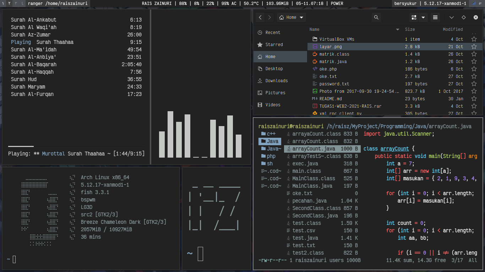

# dotfiles
My Dotfiles, its for backup my settings.

currently im using [bspwm](https://github.com/baskerville/bspwm),

 

|  |
|:--:|
| ncmpcpp, cava, nautilus, neofetch, figlet, rangerImage Credits - Fig.2 - 4K Mountains Wallpaper |